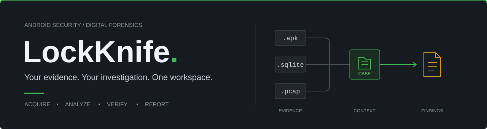
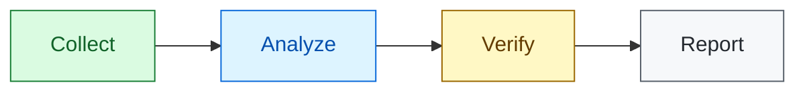

<div align="center">

<a href="https://lockknife.vercel.app">
  
</a>

# LockKnife

### Investigate Android. Keep the whole case in view.

Android security research · Digital forensics · APK reverse engineering

**Collect evidence, investigate applications, and deliver clear reports from one terminal workspace.**

<br />

[](https://github.com/ImKKingshuk/LockKnife/releases)
[](#documentation)

[](https://github.com/ImKKingshuk/LockKnife/releases)
[](#installation)
[](#installation)
[](LICENSE)

<br />

**[Features](#features) &nbsp; / &nbsp; [Installation](#installation) &nbsp; / &nbsp; [Quick Start](#quick-start) &nbsp; / &nbsp; [User Guides](#documentation) &nbsp; / &nbsp; [Website](https://lockknife.vercel.app)**

<br />

</div>

---

**LockKnife** is an open-source Android security research and digital forensics toolkit for security researchers, forensic analysts, and mobile penetration testers. Bring device extraction, offline evidence analysis, APK reverse engineering, Frida instrumentation, network forensics, and reporting into a single investigation.

Work interactively in a full-screen terminal interface or use focused CLI commands. Keep related outputs in a case, trace findings back to their inputs, and turn evidence into technical or executive reports.

<table>
<tr>
<td width="33%" align="center"><b>One case. Connected evidence.</b><br /><sub>Artifacts, analysis, sessions, and reports together.</sub></td>
<td width="33%" align="center"><b>Your workflow. Your interface.</b><br /><sub>Interactive terminal or repeatable CLI commands.</sub></td>
<td width="33%" align="center"><b>Device or offline.</b><br /><sub>Collect from Android or inspect existing evidence.</sub></td>
</tr>
</table>

## Features

### From First Artifact to Final Finding

<table>
<tr>
<td width="50%" valign="top">
<h3>01 &nbsp; Collect Android Evidence</h3>
<p>Acquire accessible messages, contacts, call logs, browser records, media, and location artifacts. Explore supported WhatsApp, Telegram, and Signal data.</p>
<p><b>Device acquisition · App artifacts · Batch extraction</b></p>
</td>
<td width="50%" valign="top">
<h3>02 &nbsp; Reconstruct the Story</h3>
<p>Inspect SQLite databases, build timelines, correlate identifiers, import ALEAPP results, and review record-recovery candidates alongside their source evidence.</p>
<p><b>Offline forensics · Timelines · Artifact correlation</b></p>
</td>
</tr>
<tr>
<td width="50%" valign="top">
<h3>03 &nbsp; Look Inside Android Apps</h3>
<p>Review manifests, permissions, and exported components. Decompile APKs with JADX or apktool, inspect DEX metadata, and scan application contents with YARA rules.</p>
<p><b>APK analysis · Reverse engineering · YARA scanning</b></p>
</td>
<td width="50%" valign="top">
<h3>04 &nbsp; Observe Apps in Motion</h3>
<p>Use Frida hooks, method tracing, memory searches, and case-linked sessions. Test supported SSL-pinning and root-detection hooks on authorized targets.</p>
<p><b>Runtime instrumentation · Memory inspection · Frida</b></p>
</td>
</tr>
<tr>
<td width="50%" valign="top">
<h3>05 &nbsp; Follow Traffic and Indicators</h3>
<p>Inspect PCAPs, discover visible API endpoints, capture device traffic, and review device security indicators. Enrich selected findings with VirusTotal or OTX.</p>
<p><b>Network forensics · Device security · Threat intelligence</b></p>
</td>
<td width="50%" valign="top">
<h3>06 &nbsp; Deliver a Traceable Case</h3>
<p>Follow artifact lineage, verify registered hashes and audit records, create technical or executive reports, and export case bundles for protected handoff.</p>
<p><b>Evidence provenance · Integrity checks · Reporting</b></p>
</td>
</tr>
</table>

**Also included:** supported legacy PIN/password recovery, credential-artifact inspection, wallet forensics, optional log anomaly scoring, and Bluetooth, Wi-Fi, and TCP discovery or protocol tools. Rust-powered hashing, recovery, and native analysis helpers support demanding tasks.

<details>
<summary><b>Android extraction and offline forensics</b> &nbsp; / &nbsp; See command examples</summary>

Create a case first, replace `DEVICE_SERIAL` with your authorized device's serial, and substitute the input paths with your evidence files.

```bash
lockknife --cli extract browser --serial DEVICE_SERIAL --app chrome --kind history --case-dir ./cases/CASE-001
lockknife --cli extract messaging --serial DEVICE_SERIAL --app whatsapp --case-dir ./cases/CASE-001
lockknife --cli forensics sqlite ./evidence/messages.db --case-dir ./cases/CASE-001
lockknife --cli forensics correlate --input ./evidence/artifacts.json --case-dir ./cases/CASE-001
```

Acquisition depends on permissions, app versions, and encryption. Protected paths may require root; collecting an encrypted database does not decrypt its messages. Carved records are recovery candidates, not automatic proof of deletion.

</details>

<details>
<summary><b>APK analysis and reverse engineering</b> &nbsp; / &nbsp; Modes and examples</summary>

| Mode | What You Get |
|------|--------------|
| `auto` | JADX, then apktool, then archive unpacking as fallbacks |
| `jadx` | Reconstructed Java-like source |
| `apktool` | Decoded resources, manifest, and Smali |
| `unpack` | Raw application files |
| `hybrid` | Combined JADX and apktool output |

```bash
lockknife --cli apk decompile ./target.apk --mode auto --output ./decompiled
lockknife --cli apk scan --apk ./target.apk --yara ./rules/secrets.yar
```

Automated security findings require review. Archive unpacking is not source-code reconstruction.

</details>

<details>
<summary><b>Frida runtime instrumentation</b> &nbsp; / &nbsp; Hooks and memory inspection</summary>

```bash
lockknife --cli runtime bypass-ssl com.example.app --device-id DEVICE_SERIAL --case-dir ./cases/CASE-001
lockknife --cli runtime memory-search com.example.app --device-id DEVICE_SERIAL --pattern "bearer"
```

Frida requires a compatible target server and sufficient permissions. Built-in hooks depend on the app implementation and can change its behavior. Explicitly stop active sessions when your work is complete.

</details>

<details>
<summary><b>Network forensics and device security</b> &nbsp; / &nbsp; Capture analysis and posture checks</summary>

```bash
lockknife --cli network api-discovery ./evidence/capture.pcap --case-dir ./cases/CASE-001
lockknife --cli security scan --serial DEVICE_SERIAL
```

Device capture requires accessible on-device `tcpdump`. Encrypted traffic may conceal endpoints and payloads; reported device properties do not independently establish hardware security.

</details>

<details>
<summary><b>Credential recovery and wallet forensics</b> &nbsp; / &nbsp; Supported evidence workflows</summary>

```bash
lockknife --cli crack pin --hash 7110eda4d09e062aa5e4a390b0a572ac0d2c0220 --algo sha1 --length 4
lockknife --cli crypto-wallet scan-device --serial DEVICE_SERIAL --case-dir ./cases/CASE-001
```

The PIN example uses the SHA-1 hash of the sample PIN `1234`. Credential tools support specific legacy hashes and accessible artifacts; they do not guarantee recovery of modern Android screen locks or hardware-backed private keys. Wallet workflows depend on the supported app format and available data.

</details>

> [!IMPORTANT]
> Use device-changing and wireless workflows only within your authorized scope. Check `lockknife --cli features` for requirements and capability status; PoC, simulated, or unavailable functions are not verified live exploits.

## Installation

### Pick Your Platform

| macOS | Linux | Windows |
|:-----:|:-----:|:-------:|
| **Homebrew** or installer | **One-line installer** | **Scoop** |
| Apple Silicon / ARM64 | x86-64 or ARM64 | x86-64 |

**Homebrew · macOS**

```bash
brew install ImKKingshuk/tap/lockknife
```

**One-line installer · macOS and Linux**

```bash
curl -fsSL https://lockknife.vercel.app/install | bash
```

**Scoop · Windows**

With Scoop installed:

```powershell
scoop bucket add imkkingshuk https://github.com/ImKKingshuk/scoop-bucket
scoop install imkkingshuk/lockknife
```

<details>
<summary><b>Prefer a Python environment?</b> &nbsp; / &nbsp; Install a prebuilt wheel</summary>

Download the matching wheel from [GitHub Releases](https://github.com/ImKKingshuk/LockKnife/releases). Use Python 3.12 or newer:

```bash
python -m pip install /path/to/downloaded-wheel.whl
```

Choose a wheel matching the operating system and architecture listed above.

</details>

<details>
<summary><b>Optional features</b> &nbsp; / &nbsp; Dependencies and setup</summary>

For wheel installations, select the extras you need:

```bash
python -m pip install '/path/to/downloaded-wheel.whl[apk,network]'
python -m pip install '/path/to/downloaded-wheel.whl[full]'
```

| Extra | Enables |
|-------|---------|
| `apk` | APK analysis |
| `frida` | Runtime instrumentation |
| `network` | Extended PCAP analysis |
| `yara` | YARA rule scanning |
| `threat-intel` | VirusTotal and OTX clients |
| `ml` | Machine-learning analysis helpers |
| `full` | All investigation extras above |

External tools still apply: JADX/apktool for decompilation, a target Frida server for instrumentation, and device `tcpdump` for capture. PDF rendering and Bleak are separate dependencies, not included in `full`. Install optional Python dependencies in the environment containing LockKnife, not an unrelated system Python.

</details>

**Device work requires Android platform-tools (`adb`) and device authorization.** Offline analysis does not require a connected device. See [Installation and Troubleshooting](docs/installation-and-troubleshooting.md) for updates and setup help.

## Quick Start

### Choose How You Work

<table>
<tr>
<td width="50%" valign="top">
<h3>Interactive Workspace</h3>
<p>Browse devices and modules, fill in action forms, and review results in a full-screen terminal.</p>
<p><code>lockknife</code></p>
<p><a href="docs/tui-walkthrough.md"><b>Follow the TUI walkthrough</b></a></p>
</td>
<td width="50%" valign="top">
<h3>Focused CLI Commands</h3>
<p>Run individual tasks, repeat an investigation workflow, or analyze evidence without opening the TUI.</p>
<p><code>lockknife --cli --help</code></p>
<p><a href="docs/headless-cli-walkthrough.md"><b>Follow the CLI walkthrough</b></a></p>
</td>
</tr>
</table>

### Your First Investigation



Start with device or local evidence, inspect artifacts and applications, verify registered hashes and case events, then share reviewed findings.

**1. Check your installation and authorized device.**

```bash
lockknife --version
lockknife --cli doctor
lockknife --cli device list
```

Replace `DEVICE_SERIAL` with a serial returned by `device list`. The examples use `./cases/CASE-001`; choose private storage for actual case data.

**2. Create a case and collect accessible evidence.**

```bash
lockknife --cli case init --case-id CASE-001 --examiner "Analyst" --title "Android Assessment" --output ./cases/CASE-001
lockknife --cli device info --serial DEVICE_SERIAL
lockknife --cli extract sms --serial DEVICE_SERIAL --format json --case-dir ./cases/CASE-001
lockknife --cli extract call-logs --serial DEVICE_SERIAL --format json --case-dir ./cases/CASE-001
```

**3. Review, verify, and report.**

```bash
lockknife --cli case summary --case-dir ./cases/CASE-001
lockknife --cli report integrity --case-dir ./cases/CASE-001 --format json
lockknife --cli report generate --case-dir ./cases/CASE-001 --template technical --format html
lockknife --cli case export --case-dir ./cases/CASE-001 --include-registered-artifacts --output ./case-001-bundle.zip
```

Use the output paths printed by each command. HTML reports are available with the base installation; PDF requires an optional renderer. Reports and bundles are not encrypted by default, so review and protect them before sharing.

<details>
<summary><b>Explore more commands</b> &nbsp; / &nbsp; Help, capabilities, and classic menus</summary>

```bash
lockknife --cli --help
lockknife --cli features
lockknife --cli actions --format json
```

Use `--help` on an individual command to see its options. Prefer numbered menus? Run `lockknife --cli interactive` and follow the [classic menu guide](docs/legacy-interactive-walkthrough.md).

</details>

## Documentation

### Find Your Next Step

| Get Started | Investigate | Protect and Share |
|-------------|-------------|-------------------|
| [Installation and troubleshooting](docs/installation-and-troubleshooting.md) | [Interactive TUI walkthrough](docs/tui-walkthrough.md) | [Case integrity and privacy](docs/case-integrity-and-privacy.md) |
| [Classic menu guide](docs/legacy-interactive-walkthrough.md) | [CLI investigation walkthrough](docs/headless-cli-walkthrough.md) | [Security and privacy](SECURITY.md) |

Follow [release notes in the changelog](CHANGELOG.md) to see what's changed between versions.

## Frequently Asked Questions

<details>
<summary><b>Do I need root or a connected Android device?</b></summary>

Not for offline analysis or case review. You can inspect local SQLite databases, APKs, PCAP files, and supported exported artifacts. Device-backed operations need a connection; protected app and system paths often need elevated access.

</details>

<details>
<summary><b>Can LockKnife unlock every Android device?</b></summary>

No. Credential recovery supports specific hashes and accessible artifacts. Modern hardware-backed credentials, encryption, and device protections cannot be assumed recoverable or bypassable.

</details>

<details>
<summary><b>Why does a feature need additional setup?</b></summary>

Some workflows need optional dependencies, external tools, provider credentials, or target permissions. Run `lockknife --cli doctor` and `lockknife --cli features` to check requirements before starting.

</details>

<details>
<summary><b>Are my investigation results sent to external services?</b></summary>

Local analysis does not require threat intelligence services. Explicit external lookups send selected indicators to their providers. Review your data-sharing policy and the [case privacy guide](docs/case-integrity-and-privacy.md) before using those integrations.

</details>

---

<div align="center">

**Authorized research. Responsible evidence handling.**

Use LockKnife only on devices, applications, and networks you are authorized to examine. Follow applicable laws and protect collected personal data.

[Website](https://lockknife.vercel.app) &nbsp; · &nbsp; [Download](https://github.com/ImKKingshuk/LockKnife/releases) &nbsp; · &nbsp; [User Guides](#documentation) &nbsp; · &nbsp; [GPL-3.0-only License](LICENSE)

</div>
