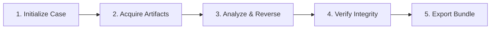

<div align="center">


# LockKnife

### Android Security Research & Digital Forensics Toolkit

**Unified Investigation Workspace · High-Performance Rust Core · Interactive TUI · Scriptable CLI**

[](https://github.com/ImKKingshuk/LockKnife/releases)
[](pyproject.toml)
[](Cargo.toml)
[](#installation)
[](LICENSE)
[](https://lockknife.vercel.app)

**[Website](https://lockknife.vercel.app) · [Installation](#installation) · [Quick Start](#quick-start) · [Features](#features) · [Workflow](#investigation-workflow) · [Documentation](#documentation)**

</div>

---

## Overview

**LockKnife** is an open-source terminal workstation designed for Android security research, digital forensics, mobile application penetration testing, and reverse engineering.

It unifies artifact acquisition, offline forensic analysis, APK reverse engineering, Frida-based dynamic runtime instrumentation, threat intelligence lookups, and verifiable reporting into a single modular framework.

Built with a high-performance **Rust core** and an extensible **Python engine**, LockKnife delivers fast multi-threaded operations (cryptographic hashing, brute-force recovery, DEX/ELF parsing, PCAP packet analysis, and SQLite extraction) through both an interactive full-screen **Terminal User Interface (TUI)** and a scriptable **Headless CLI**.

---

## Installation

### Method 1: One-Line Install Script (macOS & Linux)

For quick automated setup on macOS and Linux systems:

```bash
curl -fsSL https://lockknife.vercel.app/install | bash
```

### Method 2: Homebrew (macOS)

Install via the official Homebrew tap:

```bash
brew install ImKKingshuk/tap/lockknife
```

### Method 3: Pre-Built Release Wheels

Download the matching wheel for your architecture from [GitHub Releases](https://github.com/ImKKingshuk/LockKnife/releases) and install using `pip`:

```bash
python -m pip install /path/to/downloaded-wheel.whl
```

| Platform | Supported Architectures |
|----------|-------------------------|
| **macOS** | Apple Silicon (ARM64) |
| **Linux** | x86-64, ARM64 |
| **Windows** | x86-64 (Native & WSL) |

### Method 4: Build from Source

Prerequisites: **Python 3.12+**, **Rust toolchain** (`cargo`), and standard C/C++ build tools.

```bash
# Clone the repository
git clone https://github.com/ImKKingshuk/LockKnife.git
cd LockKnife

# Install base package
python -m pip install .
```

#### Optional Feature Extras

Install optional dependencies according to your operational needs:

```bash
# Example: Install APK analysis and network inspection tools
python -m pip install '.[apk,network]'

# Install all packaged extras
python -m pip install '.[full]'
```

| Extra | Capabilities Provided | Prerequisites |
|-------|-----------------------|---------------|
| `apk` | APK manifest, permission, and vulnerability heuristics | JADX or apktool for source decompilation |
| `frida` | Dynamic runtime hooking and instrumentation | Compatible Frida server on target device |
| `network` | Deep PCAP parsing and endpoint discovery | Scapy (`tcpdump` on-device for capture) |
| `yara` | Bytecode and pattern scanning with YARA rules | YARA library installed |
| `threat-intel` | VirusTotal and AlienVault OTX lookups | Valid service API credentials |
| `ml` | Machine-learning log anomaly detection | scikit-learn & numpy |
| `full` | All packaged extras listed above | Respective external tools apply |

---

## Quick Start

### 1. Verify Environment & Connected Devices

```bash
# Check installation and external dependency availability
lockknife --version
lockknife --cli doctor

# List connected and authorized Android devices
lockknife --cli device list
```

### 2. Choose Your Interface

| Interface | Command | Description |
|-----------|---------|-------------|
| **Interactive TUI** | `lockknife` | Full-screen visual workspace for interactive analysis and case management |
| **Headless CLI** | `lockknife --cli <command>` | Direct command execution for scripting, pipelines, and headless servers |
| **Headless Alias** | `lockknife --headless <command>` | Alternative shorthand for CLI operations |
| **Classic Menu** | `lockknife interactive` | Step-by-step menu navigation for standard terminals |

### 3. Explore Commands & Features

```bash
# View available command groups
lockknife --cli --help

# List all capabilities and requirements
lockknife --cli features

# Export all actions and parameters as JSON
lockknife --cli actions --format json
```

---

## Features

LockKnife is organized into specialized modules covering the complete Android assessment lifecycle.

### 📱 Device Acquisition & Artifact Extraction

Acquire logical evidence and system artifacts directly from connected Android devices over ADB:

- **Communications**: Extract SMS messages, contact books, and call history logs (`extract sms`, `extract contacts`, `extract call-logs`).
- **Web Browsers**: Recover history, bookmarks, downloads, cookies, and saved logins for Chrome and Firefox (`extract browser`).
- **Messaging Apps**: Extract chat databases and media for WhatsApp, Telegram, and Signal (`extract messaging`).
- **Media & EXIF**: Pull images, videos, and audio files with automatic extraction of embedded camera and GPS metadata (`extract media`).
- **System & Geolocation**: Acquire Wi-Fi network history, cell tower cache data, and dumpsys diagnostics (`extract location`).
- **Batch Acquisition**: Automated multi-dataset acquisition across accessible partitions (`extract all`).

```bash
# Extract web browser history into an active case
lockknife --cli extract browser --case-dir ./cases/CASE-01

# Extract WhatsApp messaging databases
lockknife --cli extract messaging --app whatsapp --case-dir ./cases/CASE-01
```

---

### 🔎 Deep Offline Forensics & Analysis

Inspect disk dumps, application databases, and extracted filesystem artifacts:

- **SQLite Bulk Extraction**: Native Rust engine for fast dumping and querying of SQLite databases to JSON (`forensics sqlite`).
- **Unified Timeline**: Consolidate filesystem events, browser history, communication logs, and application activity into a chronological timeline (`forensics timeline`).
- **Cross-Artifact Correlation**: Automatically connect related identifiers (IP addresses, timestamps, phone numbers) across disparate datasets (`forensics correlate`).
- **ALEAPP Integration**: Import, normalize, and correlate forensic dumps from ALEAPP (`forensics import-aleapp`).
- **Deleted Record Carving**: Heuristic scanning of database free-pages and unallocated space for deleted records (`forensics recover`).
- **Protobuf Decoding**: Parse raw binary protocol buffer streams from app caches (`forensics decode-protobuf`).

```bash
# Dump and inspect an extracted SQLite database
lockknife --cli forensics sqlite ./evidence/app_data.db --case-dir ./cases/CASE-01

# Correlate an IP address across all evidence in the case
lockknife --cli forensics correlate --query "198.51.100.24" --case-dir ./cases/CASE-01
```

---

### 🔐 Credential Recovery & Cracking

Analyze device security tokens, passwords, and lock-screen credentials:

- **Numeric PIN Recovery**: Multi-threaded Rust engine testing 4-to-8 digit PINs against extracted hash values (`crack pin`).
- **Dictionary Attacks**: Wordlist-based password recovery accelerated by Rayon parallel processing (`crack password`).
- **Rule-Based Mutations**: Mutate password lists using leetspeak, capitalization, and numeric permutations (`crack password-rules`).
- **Pattern Gesture Recovery**: Decode 3×3 pattern lock gestures from extracted `gesture.key` files (`crack gesture`).
- **Saved Wi-Fi Passwords**: Read and format saved WPA/WPA2/WPA3 network passphrases from system configurations (`crack wifi`).
- **Passkey Artifact Export**: Discover and export FIDO2 / WebAuthn passkey artifacts on Android 14+ devices (`crack passkeys`).

```bash
# Recover a numeric PIN from a SHA-1 hash with salt
lockknife --cli crack pin --hash 7110eda4d09e062aa5e4a390b0a572ac0d2c0220 --salt 12345678 --algorithm sha1

# Mutate a wordlist with permutation rules
lockknife --cli crack password-rules --wordlist wordlist.txt --ruleset standard
```

---

### 📦 APK Reverse Engineering & Decompilation

Inspect, analyze, and reverse-engineer Android application packages:

- **Manifest & Security Audit**: Audit exported activities, broadcast receivers, services, intent filters, deep links, and dangerous permissions with CVSS-based risk scoring (`apk analyze`, `apk permissions`).
- **DEX Header Parsing**: Fast native parsing of DEX/ODEX headers and string tables.
- **Pattern & YARA Scanning**: Scan APK resources and bytecode for hardcoded secrets, API tokens, and custom YARA rules (`apk scan`).
- **Multi-Mode Decompilation**: Multi-stage decompilation pipeline with automated tool fallback and safe extraction limits.

#### Decompilation Modes

| Mode | Engine | Output | Use Case |
|------|--------|--------|----------|
| `auto` (Default) | JADX ➔ apktool ➔ Unpack | Best available: Java source, resources, or raw files | General analysis |
| `jadx` | JADX Decompiler | Reconstructed Java-like source code | Logic and code audits |
| `apktool` | Apktool | Decoded `AndroidManifest.xml`, resources, and Smali | Resource review & Smali inspection |
| `unpack` | Archive Extractor | Raw unpacked contents with path safety bounds | Quick asset inspection |
| `hybrid` | JADX + Apktool | Combined Java source and decoded resources | Full vulnerability assessments |

```bash
# Decompile an APK using the automatic fallback pipeline
lockknife --cli apk decompile ./target.apk --mode auto --output ./decompiled/

# Scan an application for hardcoded credentials with custom YARA rules
lockknife --cli apk scan ./target.apk --rules ./rules/secrets.yar
```

---

### ⚡ Dynamic Runtime Instrumentation (Frida)

Inspect and hook running application processes in real time:

- **Frida Session Lifecycle**: Attach to running processes or spawn applications with custom scripts (`runtime hook`).
- **Security Bypasses**: Built-in hooks for SSL certificate unpinning and root detection evasion (`runtime bypass-ssl`, `runtime bypass-root`).
- **Interactive Method Tracing**: Monitor class loading, method invocations, and parameter values on the fly (`runtime trace`).
- **Memory Forensics**: Search live process memory for strings and patterns, or dump memory heaps (`runtime memory-search`, `runtime heap-dump`).
- **Session Logging**: Automatically record active Frida sessions, injected scripts, and console output into the case database.

```bash
# Spawn an application with automated SSL unpinning
lockknife --cli runtime bypass-ssl --package com.example.app --case-dir ./cases/CASE-01

# Search live application memory for authentication tokens
lockknife --cli runtime memory-search --package com.example.app --query "bearer"
```

---

### 🌐 Network Forensics & Security Auditing

Analyze network traffic and assess device configuration security:

- **PCAP Packet Analysis**: Parse network captures to identify API endpoints, cleartext transmissions, and DNS requests (`network analyze`, `network api-discovery`).
- **Traffic Capture**: Manage on-device `tcpdump` packet capture sessions over ADB (`network capture`).
- **Device Security Posture**: Check SELinux enforcement, bootloader lock state, Knox status, and USB attack surfaces (`security scan`).
- **OWASP MASTG Mapping**: Map automated audit findings directly to the OWASP Mobile Application Security Testing Guide (`security owasp`).

```bash
# Discover API endpoints from a network capture
lockknife --cli network api-discovery --pcap ./capture.pcap --case-dir ./cases/CASE-01

# Perform an overall device security posture check
lockknife --cli security scan
```

---

### 🧠 Threat Intelligence & Anomaly Scoring

Enrich artifacts with reputation data and automated anomaly detection:

- **Threat Intel Enrichment**: Query file hashes, domain names, and IP addresses against VirusTotal and AlienVault OTX (`intel virustotal`, `intel otx`).
- **Native IOC Matching**: Multi-pattern search for indicators of compromise across extracted evidence.
- **Log Anomaly Scoring**: Machine-learning assisted detection of unusual activity in syslog and logcat streams (`ai anomaly`).
- **Cryptocurrency Wallets**: Locate and analyze wallet databases, keystores, and mnemonic phrase artifacts (`crypto-wallet wallet`).

```bash
# Check an APK hash on VirusTotal and log results to the case
lockknife --cli intel virustotal --hash 44d88612fea8a8f36de82e1278abb02f --case-dir ./cases/CASE-01
```

---

### 🗄️ Case Management & Forensic Integrity

Track evidence, maintain artifact provenance, and generate verifiable audit records:

- **SQLite Case Repository**: Structured database recording all acquired evidence, command history, and tool execution logs.
- **Cryptographic Audit Trail**: Hash-chained event log ensuring tamper-evident tracking of all investigative actions.
- **Artifact Lineage**: Track which command, tool, or parent file produced each piece of evidence.
- **Evidence Bundles**: Export self-contained `.zip` archives containing consistent database snapshots, manifest data, logs, and artifacts.
- **Chain of Custody**: Record evidence handling events with optional cryptographic signing.

```bash
# Initialize a new case workspace
lockknife --cli case init --case-id CASE-001 --examiner "Analyst" --title "Device Audit" --case-dir ./cases/CASE-01

# Verify case audit integrity
lockknife --cli report integrity --case-dir ./cases/CASE-01

# Export a complete, portable case bundle
lockknife --cli case export --case-dir ./cases/CASE-01 --include-registered-artifacts --output ./bundle.zip
```

---

### 📄 Reporting

Generate comprehensive forensic documentation in multiple formats:

- **HTML Reports**: Interactive technical and executive summaries with evidence previews and provenance trees.
- **PDF Reports**: Formal forensic reports suitable for presentations and documentation.
- **Structured Data**: Export evidence summaries as JSON or CSV for pipeline integration.
- **Integrity Summaries**: Verification reports validating artifact hashes and audit log consistency.

```bash
# Generate an HTML forensic report
lockknife --cli report generate --case-dir ./cases/CASE-01 --format html --output ./reports/report.html
```

---

### 🧪 Wireless & Protocol Tools

Specialized utilities for authorized wireless auditing and RF research:

- **Wi-Fi Protocol Tools**: Frame crafting, probe requests, beacon generation, and association inspection (`exploit wifi`).
- **Bluetooth / BLE**: Discovery, GATT service enumeration, and RFCOMM inspection (`exploit bluetooth`).
- **Port Scanning**: Parallel TCP and service banner scanning (`exploit scan`).

---

## Investigation Workflow

A standard investigation workflow with LockKnife follows five key stages:



### 1. Initialize Case Workspace

Create an isolated case directory to store all evidence, logs, and findings:

```bash
lockknife --cli case init \
  --case-id "CASE-2026-001" \
  --examiner "Analyst" \
  --title "Device Security Assessment" \
  --case-dir "./cases/CASE-2026-001"
```

### 2. Acquire Artifacts from Target

Extract communications, browser records, and application data directly into the workspace:

```bash
lockknife --cli extract messaging --app whatsapp --case-dir "./cases/CASE-2026-001"
lockknife --cli extract browser --case-dir "./cases/CASE-2026-001"
```

### 3. Analyze Databases & Reverse-Engineer Applications

Examine application databases and decompile suspicious APKs:

```bash
# Bulk extract and inspect SQLite databases
lockknife --cli forensics sqlite ./cases/CASE-2026-001/evidence/messages.db --case-dir "./cases/CASE-2026-001"

# Decompile an APK found on the device
lockknife --cli apk decompile ./sample.apk --mode auto --case-dir "./cases/CASE-2026-001"
```

### 4. Verify Integrity & Generate Reports

Validate that all actions have been cryptographically recorded and generate a final report:

```bash
# Verify the append-only audit trail
lockknife --cli report integrity --case-dir "./cases/CASE-2026-001"

# Generate an interactive HTML report
lockknife --cli report generate --case-dir "./cases/CASE-2026-001" --format html --output ./reports/summary.html
```

### 5. Export Case Bundle

Create an archival bundle containing the SQLite database, logs, reports, and evidence:

```bash
lockknife --cli case export \
  --case-dir "./cases/CASE-2026-001" \
  --include-registered-artifacts \
  --output "./case-2026-001-bundle.zip"
```

---

## Interactive TUI Controls

When running `lockknife` in TUI mode, use the following keyboard controls:

| Key | Context | Action |
|:---:|---------|--------|
| <kbd>Tab</kbd> | Global | Switch focus between panels (Devices, Modules, Case, Output) |
| <kbd>↑</kbd> / <kbd>↓</kbd> / <kbd>←</kbd> / <kbd>→</kbd> | Global | Navigate lists, select modules, or scroll output |
| <kbd>Enter</kbd> | Modules | Open module actions dialog |
| <kbd>/</kbd> | Global | Search modules or filter output logs |
| <kbd>n</kbd> | Global | Initialize a new case workspace |
| <kbd>o</kbd> | Global | Open or switch active case directory |
| <kbd>p</kbd> | Global | Open recent cases history |
| <kbd>a</kbd> | Global | Open recent artifact search filters |
| <kbd>e</kbd> | Global | Export the latest operation result |
| <kbd>v</kbd> | Global | Open full-screen Result Viewer |
| <kbd>d</kbd> | Global | Open Diagnostics & Health check dialog |
| <kbd>c</kbd> | Global | Open configuration editor |
| <kbd>t</kbd> | Global | Cycle interface theme |
| <kbd>r</kbd> | Global | Refresh connected ADB device list |
| <kbd>?</kbd> | Global | Open contextual keyboard help |
| <kbd>Esc</kbd> | Dialogs | Close active dialog, overlay, or search prompt |
| <kbd>q</kbd> | Main View | Exit LockKnife |

---

## Tool Comparison

How LockKnife compares with other popular mobile security tools:

| Capability | LockKnife | ALEAPP | MobSF | drozer | objection | Frida |
|------------|:---------:|:------:|:-----:|:------:|:---------:|:-----:|
| **Case Workspace & Lineage** | ✅ Native | ⚠️ Reports only | ❌ | ❌ | ❌ | ❌ |
| **Audit Trail Verification** | ✅ Hash-chained | ❌ | ❌ | ❌ | ❌ | ❌ |
| **Device Artifact Extraction** | ✅ | ✅ | ❌ | ❌ | ❌ | ❌ |
| **Timeline & Cross-Artifact Correlation** | ✅ Native Rust | ⚠️ Partial | ❌ | ❌ | ❌ | ❌ |
| **APK Decompilation & Risk Scoring** | ✅ Multi-mode | ❌ | ✅ | ⚠️ Basic | ❌ | ❌ |
| **Dynamic Runtime Instrumentation** | ✅ Frida-backed | ❌ | ⚠️ Sandbox | ✅ | ✅ | ✅ |
| **PIN & Pattern Gesture Recovery** | ✅ Native Rust | ❌ | ❌ | ❌ | ❌ | ❌ |
| **Full-Screen Terminal UI (TUI)** | ✅ Ratatui | ❌ | ❌ (Web UI) | ❌ | ❌ | ❌ |
| **Scriptable Headless CLI** | ✅ | ✅ | ⚠️ API | ✅ | ✅ | ✅ |
| **Chain of Custody & PDF/HTML Reports** | ✅ | ⚠️ Partial | ✅ | ❌ | ❌ | ❌ |

---

## Configuration

LockKnife loads configuration files in the following priority order:

1. `./lockknife.toml` (Current working directory)
2. `$HOME/.config/lockknife/lockknife.toml` (User XDG configuration directory)
3. `$HOME/.lockknife.toml` (User home directory)
4. `/etc/lockknife.toml` (System-wide configuration)

### Example `lockknife.toml`

```toml
[lockknife]
log_level = "INFO"
log_format = "console"
adb_path = "adb"
preferred_device = ""

[case]
default_examiner = "Analyst"
default_case_dir = "./cases"

[ui]
theme = "dark"

[intel]
virustotal_api_key = ""
otx_api_key = ""
```

---

## Documentation

- **[TUI Walkthrough](docs/tui-walkthrough.md)**: Interactive terminal user interface guide.
- **[Headless CLI Walkthrough](docs/headless-cli-walkthrough.md)**: Command-line reference and automation examples.
- **[Classic Menu Walkthrough](docs/legacy-interactive-walkthrough.md)**: Guide for classic interactive mode.
- **[Changelog](CHANGELOG.md)**: Release history and version notes.
- **[Contributing](CONTRIBUTING.md)**: Development guidelines and pull request instructions.
- **[Security Policy](SECURITY.md)**: Vulnerability disclosure guidelines.

---

## Responsible Use & Ethics

**LockKnife** is designed exclusively for authorized security testing, digital forensics investigations, educational research, and defense auditing.

- Operating security tools against devices, applications, or networks without explicit, written authorization from the owner is illegal and unethical.
- Users are solely responsible for compliance with all applicable local, national, and international laws.
- Always follow professional rules of engagement and maintain evidence integrity standards.

---

## License

This project is licensed under the **[GNU General Public License v3.0 (GPL-3.0-only)](LICENSE)**.
